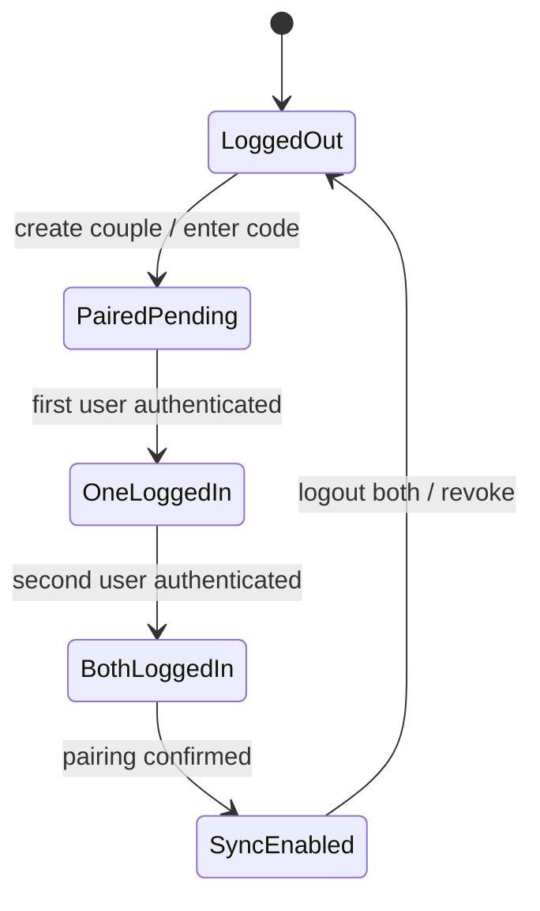

# Love Duo - Technical Documentation

A comprehensive technical specification for a couple-focused mobile application built with React Native and Expo, targeting Android in a Windows development environment.

## 1. Application Overview

- Platform: React Native with Expo (development build using Expo Dev Client)
- Target: Android-only deployment (Windows development environment)
- Tooling: Node 22+ with npm 11+ (Windows)
- Core concept: A shared space for couples to manage memories, dates, profiles, and activity history

## 2. Feature Specifications

### 2.1 Our Gallery (Primary Tab)

- Albums
  - Custom titles (e.g., `Summer Trip 2023`)
  - Date tagging per album and per photo
  - Photo upload and organization
  - Categorization by `trip`, `place`, `specialMoment`, or custom tags
- UI
  - Tab bar navigation with `Gallery`, `Dates`, `Profile`
  - Album grid view with cover image, title, count, date range
  - Creation workflow: album form → date picker → photo selection → review → save
  - Photo selection interface using device gallery
- Behaviors
  - Create, edit, delete albums
  - Add/remove photos, reorder, set cover photo
  - Filter/sort by category, date range, and tag
- Edge cases
  - Missing media permissions
  - Large image files and memory constraints
  - Offline-only mode before cloud sync

### 2.2 Dates

- Randomized suggestions
  - Title and subtitle (e.g., `Hiking Adventure — Explore a trail together`)
  - Accept to save to planned or completed
  - Regenerate for new suggestions
- Recommendation engine
  - Location suggestions with external links (Google Maps, local guides)
  - Activity tips, estimated duration, cost range
  - Historical tracking of completed dates with timestamps, notes, photos
- UI
  - Swipeable cards for browse/regenerate
  - Detail view with tips, map link, add notes/photo
  - Completion confirmation flow (mark done, add reflection)

### 2.3 Profile

- Dual-profile display
  - Couple name and shared code
  - Individual user info (photo, display name)
  - Creation statistics (dates created/suggested)
- Statistics dashboard
  - Totals: albums, photos, completed dates
  - User-specific metrics (who added photos, created albums, initiated dates)
- Recent activity
  - Last 5 dates completed or planned
- Settings
  - Couple name modification
  - Profile customization (avatar, name)
  - App preferences (theme, notifications)

### 2.4 Login / Register

- Initial screen
  - Title: `Our History`
  - Subtitle: `A special space for the couple`
  - Actions:
    - `Create new couple`: couple name input → code generation → device sync
    - `Enter with code`: code validation → pairing
- Future integrations
  - Cloud synchronization begins only after both users are logged in and paired
  - Gmail-based authentication (Google Sign-In)

## 3. System Architecture

```mermaid
flowchart TD
  A[Expo + React Native UI] --> B[Navigation: expo-router Tabs + Stack]
  B --> C[Feature Screens: Gallery, Dates, Profile, Auth]
  C --> D[State: Redux Toolkit + React Query]
  D --> E[Domain: Repositories + Services]
  E --> F[Local Storage: SQLite, SecureStore, FileSystem]
  E --> G[Remote API: REST (sync after both logged in)]
  F --> H[Media: Image Picker, Media Library, Expo Image]
  subgraph Android Platform
    I[Android SDK + Permissions]
  end
  A --> I
```

### 3.1 Component Hierarchy

- App
  - Navigation
    - Tabs
      - GalleryTab
        - AlbumGrid
          - AlbumCard
        - AlbumCreateModal
          - AlbumForm
          - DatePicker
          - PhotoSelector
      - DatesTab
        - DateSuggestionDeck
          - SuggestionCard
        - DateDetail
        - CompletionModal
      - ProfileTab
        - CoupleHeader
        - StatsDashboard
        - RecentActivityList
        - SettingsPanel
    - AuthStack
      - LoginScreen
      - RegisterScreen

### 3.2 Navigation Structure

- Top-level router using `expo-router`
  - `(tabs)/gallery`, `(tabs)/dates`, `(tabs)/profile`
  - `auth/login`, `auth/register`
  - Modal routes for creation flows

## 4. State Management Plan

- Global state: Redux Toolkit slices for `couple`, `albums`, `dates`, `users`
- Async and caching: React Query for remote data (future) and local reads
- Persistence: SQLite for structured entities, SecureStore for secrets
- Derivations: Selectors for computed stats (totals, recent activity)
- Rationale: Redux Toolkit provides explicit structure, testability, and type safety
- Alternative: Zustand for simpler stores; chosen RTK for scale and tooling
- Sync gate: `sync` slice controls cloud sync enablement based on pairing and both users’ auth states

### 4.1 Sync Slice Example

```ts
// state/sync.slice.ts
import { createSlice, PayloadAction } from "@reduxjs/toolkit"

type AuthStatus = "loggedOut" | "loggedIn"

interface SyncState {
  enabled: boolean
  isPaired: boolean
  userAAuth: AuthStatus
  userBAuth: AuthStatus
}

const initialState: SyncState = {
  enabled: false,
  isPaired: false,
  userAAuth: "loggedOut",
  userBAuth: "loggedOut",
}

const syncSlice = createSlice({
  name: "sync",
  initialState,
  reducers: {
    setPaired(state, action: PayloadAction<boolean>) {
      state.isPaired = action.payload
    },
    setUserAAuth(state, action: PayloadAction<AuthStatus>) {
      state.userAAuth = action.payload
    },
    setUserBAuth(state, action: PayloadAction<AuthStatus>) {
      state.userBAuth = action.payload
    },
    evaluateGate(state) {
      const bothLoggedIn =
        state.userAAuth === "loggedIn" && state.userBAuth === "loggedIn"
      state.enabled = state.isPaired && bothLoggedIn
    },
  },
})

const selectSyncEnabled = (root: { sync: SyncState }): boolean =>
  root.sync.enabled

const { setPaired, setUserAAuth, setUserBAuth, evaluateGate } =
  syncSlice.actions

export {
  syncSlice,
  selectSyncEnabled,
  setPaired,
  setUserAAuth,
  setUserBAuth,
  evaluateGate,
}
```

```ts
// state/store.ts
import { configureStore } from "@reduxjs/toolkit"
import { syncSlice } from "./sync.slice"

const store = configureStore({
  reducer: {
    sync: syncSlice.reducer,
  },
})

type RootState = ReturnType<typeof store.getState>

export { store, RootState }
```

```ts
// sync/observer.functions.ts
import { store } from "../state/store"
import { selectSyncEnabled } from "../state/sync.slice"
import { applySyncMode } from "../sync/gate.functions"

const observeSync = (): void => {
  let last = selectSyncEnabled(store.getState())
  applySyncMode(last)
  store.subscribe(() => {
    const current = selectSyncEnabled(store.getState())
    if (current !== last) {
      last = current
      applySyncMode(current)
    }
  })
}

export { observeSync }
```

## 5. Data Models (TypeScript)

```ts
// types/couple.types.ts
interface UserProfile {
  id: string
  displayName: string
  avatarUri?: string
}

interface CoupleProfile {
  id: string
  coupleName: string
  coupleCodeHash: string
  createdAtIso: string
  users: UserProfile[]
}

export { UserProfile, CoupleProfile }
```

```ts
// types/album.types.ts
type AlbumCategory = "trip" | "place" | "specialMoment" | "custom"

interface PhotoItem {
  id: string
  albumId: string
  uri: string
  caption?: string
  takenAtIso?: string
  tags?: string[]
}

interface Album {
  id: string
  coupleId: string
  title: string
  category: AlbumCategory
  createdAtIso: string
  coverPhotoId?: string
}

export { Album, PhotoItem, AlbumCategory }
```

```ts
// types/date.types.ts
type CostRange = "$" | "$$" | "$$$" | "free"

interface DateSuggestion {
  id: string
  title: string
  subtitle: string
  tips?: string[]
  locationName?: string
  locationUrl?: string
  estimatedDurationMinutes?: number
  costRange?: CostRange
}

interface PlannedDate {
  id: string
  coupleId: string
  suggestionId: string
  plannedAtIso: string
  notes?: string
}

interface CompletedDate {
  id: string
  coupleId: string
  suggestionId: string
  completedAtIso: string
  reflection?: string
  photoUris?: string[]
}

export { DateSuggestion, PlannedDate, CompletedDate, CostRange }
```

## 6. API Specifications (Future)

- Base URL: `https://api.loveduo.app/v1`
- Auth: Bearer token after Gmail OAuth; couple code used for pairing
- Endpoints

  - `POST /couples`
    - Request: `{ coupleName: string }`
    - Response: `{ id: string, coupleCode: string }`
  - `POST /couples/pair`
    - Request: `{ coupleCode: string, userId: string }`
    - Response: `{ coupleId: string }`
  - `GET /couples/:id`
  - `POST /albums`
  - `GET /albums?coupleId=...`
  - `POST /dates/suggestions`
    - Query params for filters: `costRange`, `outdoor`, `duration`
  - `POST /dates/planned`
  - `POST /dates/completed`

- Error model
  - `{ code: string, message: string, correlationId: string }`

## 7. Testing Strategy (Android)

- Unit: Jest for pure functions and Redux reducers
- Component: React Native Testing Library for UI behavior
- E2E: Detox for Android emulator (Windows supported)
- Coverage: 100% on core modules; CI gate on `develop`

- Commands

  - `npm run test:unit`
  - `npm run test:integration`
  - `npm run test:e2e`
  - `npm run test:coverage`

- Detox setup (Android)
  - Install Android SDK, create AVD (Pixel), ensure `adb` in `PATH`
  - Configure Detox with `gradle` Android project via `npx expo prebuild`

## 8. Build & Deployment (Expo)

- Development build
  - Install Expo Dev Client: `npx expo install expo-dev-client`
  - Build APK/AAB for dev: `eas build --profile development --platform android`
  - Install on device/emulator via `adb install`
- Production build (future)

  - `eas build --profile production --platform android`
  - Submit: `eas submit --platform android`

- Windows prerequisites
  - Node 22+ with npm 11+
  - Android Studio, SDK Platform 34+, Build-Tools
  - Environment variables: `ANDROID_HOME`, add `platform-tools` to `PATH`

## 9. Implementation Guidelines

### 9.1 Expo Configuration (Android)

```ts
// app.config.ts
import { ConfigContext, ExpoConfig } from "@expo/config"

export default ({ config }: ConfigContext): ExpoConfig => ({
  ...config,
  name: "Love Duo",
  slug: "love-duo",
  scheme: "loveduo",
  android: {
    package: "app.loveduo.mobile",
    permissions: ["READ_MEDIA_IMAGES"],
    icon: "./assets/android-icon.png",
  },
  plugins: [
    "expo-router",
    "expo-image",
    "expo-media-library",
    "expo-image-picker",
    "expo-file-system",
    "expo-secure-store",
    "expo-sqlite",
  ],
})
```

### 9.2 Android Requirements

- Request runtime permissions for images on Android 13+
- Use `expo-image` for performant rendering and caching
- Use `expo-media-library` for album/photo access

### 9.3 Performance Considerations

- Image handling
  - Use thumbnails and lazy-load full-size on demand
  - Pre-cache covers and visible grid items
  - Prefer `expo-image` with `contentFit` and caching
- Lists
  - Use `FlatList` with `getItemLayout`, `maxToRenderPerBatch`, `windowSize`
- Storage
  - Store only URIs, not binary blobs, in SQLite

### 9.4 Security Measures (Couple Code)

- Code generation
  - Use secure random `nanoid` with custom alphabet
  - Minimum 6 chars, avoid ambiguous characters (O/0, I/1)
- Storage
  - Store `coupleCodeHash` using SHA-256 locally
  - Keep raw codes only in `SecureStore`
- Pairing
  - Validate format and rate-limit attempts
  - Never log raw codes

### 9.5 Local Storage Strategy

- Usage policy

  - Use SQLite as the primary local storage mechanism both before and after authentication
  - Trigger cloud sync only after both users are authenticated and paired, layering remote sync on top of local SQLite storage
  - Retain all data locally prior to sync; no remote calls

- SQLite schema
  - Tables: `couple`, `user`, `album`, `photo`, `planned_date`, `completed_date`
  - Indices on foreign keys and timestamps
- FileSystem
  - Store images in app cache or reference device URIs
- Sync-ready
  - Include `lastModifiedIso` for conflict resolution when cloud sync arrives

#### SQLite Initialization Example

```ts
// storage/sqlite.ts
import * as SQLite from "expo-sqlite"

const db = SQLite.openDatabase("love_duo.db")

const init = (): Promise<void> =>
  new Promise((resolve, reject) => {
    db.transaction(
      (tx) => {
        tx.executeSql(
          `CREATE TABLE IF NOT EXISTS couple(
          id TEXT PRIMARY KEY,
          coupleName TEXT NOT NULL,
          coupleCodeHash TEXT NOT NULL,
          createdAtIso TEXT NOT NULL
        )`
        )
        tx.executeSql(
          `CREATE TABLE IF NOT EXISTS album(
          id TEXT PRIMARY KEY,
          coupleId TEXT NOT NULL,
          title TEXT NOT NULL,
          category TEXT NOT NULL,
          createdAtIso TEXT NOT NULL,
          coverPhotoId TEXT
        )`
        )
        tx.executeSql(
          `CREATE TABLE IF NOT EXISTS photo(
          id TEXT PRIMARY KEY,
          albumId TEXT NOT NULL,
          uri TEXT NOT NULL,
          caption TEXT,
          takenAtIso TEXT,
          tags TEXT
        )`
        )
        resolve()
      },
      (error) => reject(error)
    )
  })

export { db, init }
```

## 10. Example Implementations

### 10.1 Couple Code Generation

```ts
// services/code.functions.ts
import { customAlphabet } from "nanoid"

const ALPHABET = "ABCDEFGHJKLMNPQRSTUVWXYZ23456789"
const LENGTH = 6

const generateCoupleCode = (): string => {
  const nano = customAlphabet(ALPHABET, LENGTH)
  return nano()
}

export { generateCoupleCode }
```

### 10.2 Album Creation Flow (UI Sketch)

```txt
[Gallery Tab]
┌─────────────────────────────────────────────┐
│  + New Album                                │
│  [Grid of Album Cards]                      │
└─────────────────────────────────────────────┘

[New Album Modal]
┌─────────────────────────────────────────────┐
│ Title: [           ]                        │
│ Category: [trip|place|specialMoment|custom] │
│ Date:  [📅 picker]                          │
│ [Select Photos]                             │
│ [Save]                                      │
└─────────────────────────────────────────────┘
```

### 10.3 Dates Suggestion Card (UI Sketch)

```txt
[Dates Tab]
┌─────────────────────────────────────────────┐
│ Hiking Adventure                            │
│ Explore a trail together                    │
│ Tips: bring water, choose shaded routes     │
│ [Map Link] [Details]                        │
│ [Accept]   [Regenerate]                     │
└─────────────────────────────────────────────┘
```

### 10.4 Profile Overview (UI Sketch)

```txt
[Profile Tab]
┌─────────────────────────────────────────────┐
│ Couple: The Wanderers    Code: [Tap to View]│
│ Users: Anna • Ben                            │
│ Stats: Albums 12 | Photos 243 | Dates 18     │
│ Recent: 5 most recent dates                  │
│ [Settings]                                   │
└─────────────────────────────────────────────┘

Note: The couple code should be masked by default and
only revealed when the user explicitly taps to view it,
ensuring alignment with security guidelines in section 9.4.
```

## 11. Quality Assurance

### 11.1 UI/UX Validation Checklist

- Consistent tab navigation and back behavior
- Accessible touch targets and labels
- Smooth image loading, no stutter on scroll
- Clear feedback on actions (create, accept, complete)
- Offline-friendly interactions and graceful errors

### 11.2 Functional Test Cases

- Gallery: create/edit/delete album, add/remove photos, set cover
- Dates: generate, accept, complete, regenerate, detail navigation
- Profile: modify couple name, update avatar, stats correctness
- Auth: create couple, pair by code, invalid code handling

### 11.3 Cross-Device Compatibility

- Android API 26–35
- Screen sizes: small, normal, large, xlarge
- Density: mdpi, hdpi, xhdpi, xxhdpi
- Test on mid-range devices for performance

### 11.4 Performance Benchmarks

- App cold start < 2.5s on mid-range device
- Gallery grid scroll FPS ≥ 55
- Memory footprint stable under 250 MB with 1k photos URIs loaded lazily

## 12. Build & Release Process

- Branching: `feature/*` → `develop` → `staging` → `main`
- CI: run tests, lint, type-check on PR to `develop`
- EAS
  - Development: quick cycles, emulator install via `adb`
  - Staging and Production profiles when cloud sync is ready

## 13. Security

- Do not log PII or raw couple codes
- Hash codes at rest, store tokens in `SecureStore`
- Validate inputs with schema (e.g., Zod)
- Rate-limit pairing attempts client-side and server-side (future)

## 14. Future Roadmap

- Cloud sync
  - Bi-directional sync with conflict resolution using `lastModifiedIso`
  - Background sync, progress reporting
- Gmail auth via Google Sign-In (Expo Auth Session)
- iOS support (Expo multi-platform)
- Sharing: generate shareable album links after cloud sync

## 15. Technical Decisions & Alternatives

- Navigation: chose `expo-router` for file-based routing; alternative is React Navigation traditional setup
- State: chose Redux Toolkit + React Query for scale; alternative is Zustand for smaller apps
- Storage: chose SQLite for structured data and queries; alternative is AsyncStorage for simple key-value, not ideal for relations
- Images: chose `expo-image` for performance; alternative is `Image` with manual caching

---

### Appendix: Example Environment Validation (Optional)

```ts
// env/env.ts
import { z } from "zod"

const envSchema = z.object({
  NODE_ENV: z.enum(["development", "staging", "production"]),
  LOG_LEVEL: z.enum(["error", "warn", "info", "debug"]).default("info"),
})

const env = envSchema.parse(process.env)

export { env }
```

## 16. Sync Gating Model

### 16.1 State Diagram



- Sync is disabled in `LoggedOut`, `PairedPending`, and `OneLoggedIn`
- Sync is enabled only in `SyncEnabled` (both users logged in and paired)
- Local operations (SQLite + SecureStore) remain fully functional in all states

### 16.2 Pseudocode: Sync Gate

```ts
// sync/gate.functions.ts
type AuthStatus = "loggedOut" | "loggedIn"

interface CoupleSyncGateInput {
  isPaired: boolean
  userAAuth: AuthStatus
  userBAuth: AuthStatus
}

const isSyncEnabled = (input: CoupleSyncGateInput): boolean => {
  const bothLoggedIn =
    input.userAAuth === "loggedIn" && input.userBAuth === "loggedIn"
  return input.isPaired && bothLoggedIn
}

interface SyncState {
  enabled: boolean
}

const applySyncMode = (enabled: boolean): SyncState => {
  if (enabled) {
    enableSyncQueue()
    allowRemoteReads()
    allowRemoteWrites()
  } else {
    disableSyncQueue()
    blockRemoteReads()
    blockRemoteWrites()
  }
  return { enabled }
}

const enableSyncQueue = (): void => {}
const allowRemoteReads = (): void => {}
const allowRemoteWrites = (): void => {}
const disableSyncQueue = (): void => {}
const blockRemoteReads = (): void => {}
const blockRemoteWrites = (): void => {}

export { isSyncEnabled, applySyncMode }
```

### 16.3 Integration Notes

- Evaluate the gate on app start and whenever auth or pairing changes
- Persist `SyncState.enabled` in Redux; drive UI/feature flags accordingly
- Queue unsynced local changes; flush when `enabled` transitions to true
